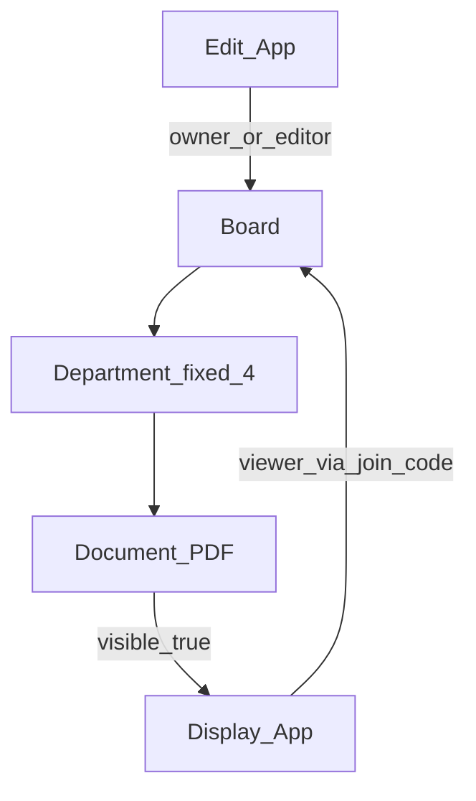

# 電子掲示板（PDF）MVP 要件プラン

工場向けデジタル掲示板の MVP 要件。Web の編集アプリと表示アプリを分離し、Supabase 上の共有ボード（参加コードで紐づけ）に PDF 資料を部単位で管理・表示する。

## プロダクト定義

工場の壁掛けディスプレイ向け **デジタル掲示板**。  
「ホワイトボード（手書き）」や注釈レイヤーは対象外。PDF 資料の公開・閲覧が本体。

参考画像は **ボタンで資料を選ぶ導線のみ** を参考にし、見た目・枠レイアウトは再現しない。

## アプリ構成

| アプリ | 役割 |
|--------|------|
| **編集アプリ** | 資料の追加・削除・表示/非表示。同時編集はボードあたり 1 人 |
| **表示アプリ** | 部選択 → 表示中資料のボタン一覧 → PDF 閲覧（ページ送り。ズームはあれば尚可。全画面不要） |

- どちらも **Web**
- **別アプリ**としてデプロイ（共通は Supabase プロジェクト）
- 編集中ページと表示中ページの同期は **不要**
- 表示への反映は **保存後**（リアルタイムミラー不要。保存後の一覧更新で足りる）

## 共有・認証（決定事項）

**参加コード方式**（別アカウント共有で最も単純）:

1. 編集アカウントがログインし **ボード（掲示板）** を作成すると、短い参加コードが発行される
2. 表示アカウントがログインし、参加コードを入力してボードに **viewer** として参加
3. 以降、同じボードの資料を編集/表示で共有

- 1 ボードあたり **編集ロックは同時 1 人**（アカウント全体で編集者 1 人制約をボード単位で実装）
- 表示側アカウントは複数可（キオスク複数台を想定）

## 情報構造

**部（MVP は固定・改名・追加なし）**

- 総務課
- 品質管理
- 製造
- 試作

**資料（Document）**

- PDF ファイル（Supabase Storage）
- タイトル（ボタン表示名）
- 所属部
- `visible`（表示/非表示）
- 作成・更新日時

## 画面フロー

### 編集アプリ

1. ログイン
2. ボード作成 / 参加コード表示
3. **資料ホーム**: 4 部から選択
4. 部の資料一覧: **追加 / 削除 / 表示・非表示切替**
5. 保存（アップロード完了・メタデータ更新）後、表示側が再取得すると反映

### 表示アプリ

1. ログイン
2. 参加コード入力（未参加の場合）
3. **資料ホーム**: 同じ 4 部から選択
4. その部の **`visible = true` の資料** をボタン一覧で表示
5. ボタン押下 → PDF 表示（ページ送り、ズーム任意）

## スコープ外（今回やらない）

- 手書き・注釈・別レイヤー・PDF 焼き込み
- 複数人同時編集
- リアルタイムなページ/カーソル同期
- 部の追加・削除・改名
- 参考画像どおりの装飾 UI（写真・木目メニュー等）
- 全画面表示

## 技術方針（実装時の前提）

- **Supabase**: Auth、Postgres、Storage、RLS
- 主要テーブル案: `boards`, `board_members`（role: editor/viewer）, `departments`（固定シード）, `documents`
- Storage: ボード単位の PDF パス
- PDF 表示: ブラウザ向け PDF ビューア（例: pdf.js）
- 一覧更新: 保存後の再取得。必要なら Supabase Realtime で documents 変更通知（必須ではない）

## 実装が重くなりやすい点（MVP でも残るもの）

- PDF アップロードと Storage + RLS
- 編集ロック（同時 1 編集者）
- 表示/編集の権限分離（RLS）
- 大画面向け PDF ページ送りの操作性

注釈・同時編集・リアルタイムミラーを外したため、初期構想より大幅に軽い。

## 次のステップ（実装フェーズで行うこと）

要件確定後:

1. monorepo または 2 リポジトリで edit / display の Web 骨格を作成
2. Supabase スキーマ・RLS・Storage を用意
3. 編集アプリ（部選択・CRUD・visible）
4. 表示アプリ（参加・部選択・PDF 閲覧）
5. 保存後の表示反映を確認
